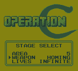
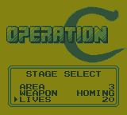
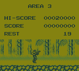
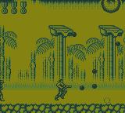

# Operation C: Level Select

Operation C: Level Select turns the game's hidden stage selector into
a pre-game setup menu. Choose any of the five areas, start with any weapon, and
set the starting lives—including Infinite—while retaining the original slide-in
animation.

[Download the v1.0 patch and instructions](https://github.com/wavedout/Operation-C-Level-Select-ROM-Hack/releases/download/v1.0/operation-c-level-select-v1.0.zip)

Target ROM: `Operation C (USA).gb` (128 KiB, MBC1, Rev. 0)

- CRC32: `2EBBC1AE`
- MD5: `c6effb3a51b36056411760d1ffe048f7`
- SHA-1: `1dc3e1c62e62f77ac633408b544ac1d02b3761eb`
- SHA-256: `0b6670e44cc2edc6fbf32fc78f499e774cf0802019480f2bf7bdb836ee15c433`
- The original ROM is never modified.

## Installation

1. Obtain a clean copy of the supported `Operation C (USA)` Rev. 0 Game Boy
   ROM. The ROM is not included with this project.
2. Confirm that its hash matches one of the values above.
3. Apply `operation-c-level-select-v1.0.bps` with a BPS-compatible
   patcher such as ROM Patcher JS.
4. Load the patched ROM in an emulator, flash cart, or other compatible device.

Expected patched-ROM SHA-256:
`ffb953cc95d7c53d65c7a461282123551fa32f802dd6caf3a91404e41196e014`

## Version 1.0 menu

Start at the title screen opens the game's hidden stage-select panel as a
complete pre-game setup menu. The original right-to-left slide-in animation is retained,
and the taller panel overlays only the lower portion of the Operation C logo.

- `UP` / `DOWN`: move the arrow between Area, Weapon, and Lives
- `LEFT` / `RIGHT`: change the selected value
- `START`: begin the selected area

Available settings:

- Area: 1–5
- Weapon: Normal, Spread 3, Spread 5, Homing, Fire
- Lives: 3, 5, 10, 20, Infinite

Infinite lives preserves the normal death and checkpoint sequence but does not
decrement the reserve-life counter. The sound test and practice mode are not
included.

Weapon selection applies the complete five-byte runtime preset used by the
game’s native power-up routine. This is necessary for the correct projectile
count, timing, behavior, and graphics—not just the displayed weapon ID.

## Screenshots

| Stage Select | Area 3 selected | Area 3 start | Gameplay |
|---|---|---|---|
|  |  |  |  |

## Build

Building from source requires RGBDS (`rgbasm` and `rgblink`):

```sh
python3 build.py "/path/to/Operation C (USA).gb"
```

This creates:

- `build/Operation C (USA) [Level Select v1.0].gb`
- `build/operation-c-level-select-v1.0.bps`

The builder verifies the clean-ROM SHA-256, assembles `src/main.asm`, applies
only its declared sections, repairs the global checksum, and creates a BPS
patch with source, target, and patch checksums. It never writes to the source ROM.

## Verification status

- PASS — clean input hash and original ROM checksum remain unchanged.
- PASS — title-screen Start opens the Level Select menu.
- PASS — stock slide-in animation retained; expanded panel and cursor render correctly.
- PASS — Up/Down row changes use the same bank-safe redraw gateway as Left/Right.
- PASS — Up/Down row navigation and Left/Right value changes, including wraparound.
- PASS — all five areas reach gameplay.
- PASS — all five starting-weapon values reach gameplay.
- PASS — all five complete native weapon presets are installed; automated firing
  checks show the expected normal, three-way, five-way, homing, and Fire shots.
- PASS — the native in-level pickup handler replaces each of the five selected
  starting weapons with the collected weapon preset and remains stable afterward.
- PASS — 3, 5, 10, and 20 lives are encoded as the game's BCD reserve counts.
- PASS — automated death-cycle test decrements finite lives and preserves Infinite lives.
- PASS — selecting END on the stock Continue screen and confirming with Start
  returns through the normal boot/title sequence.
- PASS — menu-only row and weapon-selection state is cleared before gameplay;
  Infinite uses the game's persistent default-lives byte instead of scratch RAM.
- PASS — Area 4 reaches its boss arena, renders the boss, and continues running
  beyond the transition that froze in v0.2.2.
- PASS — automated Area 4 boss clear advances into Area 5 with Infinite lives.
- PASS — bank 3's trailing stage-data region is completely untouched. Expanded
  menu code lives in unused bank 4 and bank 6 space, with 32 bytes of guard
  padding left ahead of each injected region.
- PASS — full game and ending sequence completed on a Super Game Boy. The stock
  post-credits behavior—Start beginning Area 1 again with the score intact—is
  preserved.
